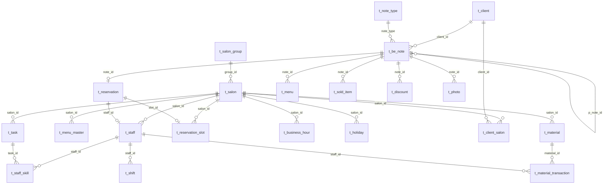

# DB設計書

> Be:note サロン予約管理システム

---

## 概要

- DB：PostgreSQL（Supabase）
- 文字コード：UTF-8
- タイムゾーン：UTC で保存、表示時に JST 変換
- 論理削除：`delete_flg BOOLEAN NOT NULL DEFAULT false` で統一
- 日時型：`TIMESTAMPTZ`（タイムゾーン付き）
- 主キー：全テーブル **UUID（v7 推奨）**。時系列ソート可・クライアント生成可で、スマホアプリのオフライン作成／同期に対応する。サーバ採番は `gen_random_uuid()`、クライアント採番は UUID v7 を用いる
- 識別子の人間可読性は PK に持たせない。表示用は名称カラムや `creation_datetime` を用いる
- 例外：`t_note_type` は固定語彙のため `SMALLINT`（コード値 `note_type_code` で受け渡し）

---

## ER図



---

## テーブル定義

### マスタ系

#### t_salon_group（サロングループ）

```sql
CREATE TABLE t_salon_group (
    group_id    UUID  PRIMARY KEY DEFAULT gen_random_uuid(),       -- UUID v7（例）
    group_name  VARCHAR(50)  NOT NULL,
    delete_flg  BOOLEAN      NOT NULL DEFAULT false
);
```

#### t_salon（サロン）

```sql
CREATE TABLE t_salon (
    salon_id              UUID  PRIMARY KEY DEFAULT gen_random_uuid(),    -- UUID v7（例）
    group_id              UUID  REFERENCES t_salon_group,
    salon_name            VARCHAR(50)  NOT NULL,
    salon_type            VARCHAR(20)  NOT NULL DEFAULT 'hair',
      -- 'hair' | 'nail' | 'esthe' | 'other'
    address               VARCHAR(100),
    phone                 VARCHAR(20),
    cancel_deadline_days  INTEGER      NOT NULL DEFAULT 1,
      -- キャンセル可能期限（日数）。1=当日キャンセル不可
    delete_flg            BOOLEAN      NOT NULL DEFAULT false,
    CONSTRAINT check_salon_type CHECK (salon_type IN ('hair', 'nail', 'esthe', 'other'))
);
```

#### t_staff（スタッフ）

```sql
CREATE TABLE t_staff (
    staff_id        UUID  PRIMARY KEY DEFAULT gen_random_uuid(),    -- UUID v7（例）
    user_id         UUID  UNIQUE REFERENCES auth.users(id),  -- Supabase Auth 連携（ログインユーザー）
    salon_id        UUID  NOT NULL REFERENCES t_salon,
    staff_name      VARCHAR(20)  NOT NULL,
    staff_kana      VARCHAR(20),
    position        VARCHAR(10)  NOT NULL,            -- 職位: 'stylist' | 'assistant'
    is_admin        BOOLEAN      NOT NULL DEFAULT false,  -- 管理者権限（true で JWT ロール=admin を付与）
    nomination_fee  INTEGER      NOT NULL DEFAULT 0,  -- 指名料（税込）
    delete_flg      BOOLEAN      NOT NULL DEFAULT false,
    CONSTRAINT check_staff_position CHECK (position IN ('stylist', 'assistant'))
);
```

#### t_staff_skill（スタッフ可能タスク）

アシスタントのタスク制限を管理する。レコードが存在するタスクのみ担当可能。

```sql
CREATE TABLE t_staff_skill (
    staff_id  UUID  NOT NULL REFERENCES t_staff,
    task_id   UUID      NOT NULL REFERENCES t_task,
    PRIMARY KEY (staff_id, task_id)
);
```

#### t_menu_master（メニューマスタ）

```sql
CREATE TABLE t_menu_master (
    menu_master_id   UUID       PRIMARY KEY DEFAULT gen_random_uuid(),
    salon_id         UUID  NOT NULL REFERENCES t_salon,
    menu_name        VARCHAR(20)  NOT NULL,   -- 'cut' | 'color' | 'treatment' ...
    kinds            VARCHAR(20),             -- 種別（'short_color' など）
    base_price       INTEGER      NOT NULL,   -- 技術料（税込）
    duration_minutes INTEGER      NOT NULL,   -- 標準所要時間（分）
    delete_flg       BOOLEAN      NOT NULL DEFAULT false,
    CONSTRAINT check_base_price CHECK (base_price >= 0),
    CONSTRAINT check_duration CHECK (duration_minutes > 0)
);
```

#### t_task（工程マスタ）

予約ボードの列（check_in → wash → cut → ... → check_out）を定義する。

```sql
CREATE TABLE t_task (
    task_id     UUID      PRIMARY KEY DEFAULT gen_random_uuid(),
    salon_id    UUID  NOT NULL REFERENCES t_salon,
    task_name   VARCHAR(20)  NOT NULL,    -- 'check_in' | 'wash' | 'cut' ...
    task_order  INTEGER      NOT NULL,    -- 列の表示順
    role_limit  VARCHAR(10)  DEFAULT NULL -- NULL=制限なし | 'stylist'=position が stylist のみ可
);
```

#### t_note_type（note種別マスタ）

```sql
CREATE TABLE t_note_type (
    note_type_id   SMALLINT     PRIMARY KEY,
    note_type_code VARCHAR(20)  NOT NULL UNIQUE,  -- API で使用する文字列
    description    VARCHAR(50)
);

INSERT INTO t_note_type VALUES
  (1, 'head',        '来店親ノード'),
  (2, 'reservation', '予約'),
  (3, 'item',        '物販'),
  (4, 'discount',    '割引'),
  (5, 'photo',       '写真'),
  (6, 'text',        'テキストメッセージ');
```

#### t_business_hour（営業時間マスタ）

```sql
CREATE TABLE t_business_hour (
    salon_id    UUID  NOT NULL REFERENCES t_salon,
    day_of_week SMALLINT     NOT NULL,  -- 0=日 1=月 ... 6=土
    open_time   TIME         NOT NULL,
    close_time  TIME         NOT NULL,
    PRIMARY KEY (salon_id, day_of_week),
    CONSTRAINT check_day_of_week CHECK (day_of_week BETWEEN 0 AND 6),
    CONSTRAINT check_business_time CHECK (open_time < close_time)
);
```

#### t_holiday（定休日・臨時休業）

```sql
CREATE TABLE t_holiday (
    salon_id      UUID  NOT NULL REFERENCES t_salon,
    holiday_date  DATE         NOT NULL,
    reason        VARCHAR(50),   -- '定休日' | '夏季休業' など
    PRIMARY KEY (salon_id, holiday_date)
);
```

#### t_shift（スタッフシフト）

```sql
CREATE TABLE t_shift (
    shift_id    UUID       PRIMARY KEY DEFAULT gen_random_uuid(),
    staff_id    UUID  NOT NULL REFERENCES t_staff,
    shift_date  DATE         NOT NULL,
    start_time  TIME         NOT NULL,
    end_time    TIME         NOT NULL,
    delete_flg  BOOLEAN      NOT NULL DEFAULT false,
    CONSTRAINT check_shift_time CHECK (start_time < end_time)
);

-- 1日に複数シフト（中抜け・分割シフト）を許容するため一意制約は設けない。
-- 同一スタッフの時間帯重複は排他制約で防ぐ。
CREATE INDEX idx_shift_staff_date
    ON t_shift (staff_id, shift_date)
    WHERE delete_flg = false;

CREATE EXTENSION IF NOT EXISTS btree_gist;
ALTER TABLE t_shift
  ADD CONSTRAINT no_shift_overlap
  EXCLUDE USING gist (
    staff_id WITH =,
    (tsrange(shift_date + start_time, shift_date + end_time)) WITH &&
  )
  WHERE (delete_flg = false);
```

#### t_reservation_slot（予約枠）

```sql
CREATE TABLE t_reservation_slot (
    slot_id     UUID       PRIMARY KEY DEFAULT gen_random_uuid(),
    salon_id    UUID  NOT NULL REFERENCES t_salon,
    slot_name   VARCHAR(30)  NOT NULL,
    delete_flg  BOOLEAN      NOT NULL DEFAULT false
);
```

---

### 顧客系

#### t_client（顧客）

顧客はプラットフォームレベルで管理する（特定サロンに紐づかない）。  
ランク・来店回数・メモはサロンごとに `t_client_salon` で管理する。  
年齢（`age`）は `birthday` から算出するため保存しない。

```sql
CREATE TABLE t_client (
    client_id    UUID  PRIMARY KEY DEFAULT gen_random_uuid(),   -- UUID v7（例）
    user_id      UUID  UNIQUE REFERENCES auth.users(id),  -- Supabase Auth 連携。NULL=アプリ未登録の店頭顧客
    family_id    UUID       ,                -- 家族グループID（同一IDで家族を紐付け）
    client_name  VARCHAR(20)  NOT NULL,
    client_kana  VARCHAR(20)  NOT NULL,
    sex          SMALLINT     NOT NULL,      -- 1=男性 2=女性
    birthday     DATE,
    postcode     VARCHAR(10),
    address      VARCHAR(100),
    phone_number VARCHAR(20),
    hair_type    VARCHAR(30),
    allergy      VARCHAR(30),
    occupation   VARCHAR(20),
    delete_flg   BOOLEAN      NOT NULL DEFAULT false,
    CONSTRAINT check_client_sex CHECK (sex IN (1, 2))
);
```

#### t_client_salon（顧客×サロン）

顧客とサロンの関係。ランク・来店回数・メモをサロンごとに管理する。

```sql
CREATE TABLE t_client_salon (
    client_id    UUID  NOT NULL REFERENCES t_client,
    salon_id     UUID  NOT NULL REFERENCES t_salon,
    client_rank  VARCHAR(10),               -- 'Bronze' | 'Silver' | 'Gold' など
    total_visit  INTEGER      NOT NULL DEFAULT 0,
    first_visit  DATE,
    memo         VARCHAR(300),
    delete_flg   BOOLEAN      NOT NULL DEFAULT false,
    PRIMARY KEY (client_id, salon_id)
);
```

---

### Be:note系

#### t_be_note（Be:note共通ヘッダ）

1来店 = 1つの `head` ノードを親とする。  
`p_note_id` が `NULL` の場合は `head`（親ノード／ルート）。

```sql
CREATE TABLE t_be_note (
    note_id          UUID  PRIMARY KEY DEFAULT gen_random_uuid(),
      -- UUID v7（クライアント生成可）
    p_note_id        UUID  REFERENCES t_be_note(note_id),  -- NULL=head（親ノード／ルート）
    note_version       INTEGER      NOT NULL DEFAULT 1,  -- 編集版番号（楽観ロック兼用。過去版は保持しない。履歴が必要なら将来 t_be_note_history を検討）
    note_type          SMALLINT     NOT NULL REFERENCES t_note_type(note_type_id),
    salon_id           UUID  NOT NULL REFERENCES t_salon,
    client_id          UUID  NOT NULL REFERENCES t_client,
    responsible        UUID  REFERENCES t_staff(staff_id),  -- 来店全体の主担当（指名なしリクエストは NULL。承認/確定時に割当）
    creation_datetime  TIMESTAMPTZ  NOT NULL DEFAULT now(),
    future_flg         BOOLEAN      NOT NULL DEFAULT false,  -- true=未来の予約
    is_client          BOOLEAN,     -- textノードのみ使用（true=顧客からのメッセージ）
    text               VARCHAR(300),  -- textノードのみ使用
    read_flg           BOOLEAN,     -- textノードのみ使用
    delete_flg         BOOLEAN      NOT NULL DEFAULT false,
    CONSTRAINT check_head_has_no_parent CHECK (NOT (note_type = 1 AND p_note_id IS NOT NULL)),  -- head はルート
    CONSTRAINT check_text_node_has_text CHECK (NOT (note_type = 6 AND text IS NULL))            -- text は本文必須
);

CREATE INDEX idx_be_note_client ON t_be_note (client_id, salon_id);
CREATE INDEX idx_be_note_parent ON t_be_note (p_note_id);
```

#### t_reservation（予約明細）

`t_be_note.note_type = 2`（reservation）のノードに対応する明細。

```sql
CREATE TABLE t_reservation (
    note_id          UUID  PRIMARY KEY REFERENCES t_be_note,
    salon_id           UUID  NOT NULL REFERENCES t_salon,
    staff_id           UUID  REFERENCES t_staff,  -- 担当スタッフ（指名なしリクエストは NULL。confirmed 以上は非 NULL 必須＝アプリ層で担保）
    slot_id            UUID      REFERENCES t_reservation_slot,
    status             VARCHAR(20)  NOT NULL DEFAULT 'confirmed',
      -- 'draft'|'requested'|'pending'|'confirmed'|
      -- 'checked_in'|'in_progress'|'done'|'rejected'|'cancelled'
    reserve_type       VARCHAR(10)  NOT NULL DEFAULT 'immediate',
      -- 'immediate'|'request'
    reservation_start  TIMESTAMPTZ  NOT NULL,
    reservation_end    TIMESTAMPTZ  NOT NULL,
    actual_start       TIMESTAMPTZ,           -- 実際の来店時刻
    actual_end         TIMESTAMPTZ,           -- 実際の退店時刻
    main_menu          VARCHAR(20)  NOT NULL,
    total              INTEGER,               -- 会計合計（税込）NULL=未会計
    payment_method     VARCHAR(10),           -- NULL|'cash'|'card'|'qr'
    current_task_id    UUID      REFERENCES t_task,
    cancel_reason      VARCHAR(100),
    no_show_flg        BOOLEAN      NOT NULL DEFAULT false,
    idempotency_key    UUID         UNIQUE,
    version_no         INTEGER      NOT NULL DEFAULT 1,  -- 楽観ロック（編集競合検出。note_version とは別）
    CONSTRAINT check_reservation_status CHECK (status IN ('draft', 'requested', 'pending', 'confirmed', 'checked_in', 'in_progress', 'done', 'rejected', 'cancelled')),
    CONSTRAINT check_reserve_type CHECK (reserve_type IN ('immediate', 'request')),
    CONSTRAINT check_reservation_time CHECK (reservation_start < reservation_end),
    CONSTRAINT check_actual_time CHECK (actual_start IS NULL OR actual_end IS NULL OR actual_start < actual_end),
    CONSTRAINT check_total_non_negative CHECK (total IS NULL OR total >= 0),
    CONSTRAINT check_payment_method CHECK (payment_method IS NULL OR payment_method IN ('cash', 'card', 'qr'))
);

-- ダブルブッキング防止（DB層）
CREATE EXTENSION IF NOT EXISTS btree_gist;
ALTER TABLE t_reservation
  ADD CONSTRAINT no_double_booking
  EXCLUDE USING gist (
    staff_id WITH =,
    (tstzrange(reservation_start, reservation_end, '[)')) WITH &&
  )
  WHERE (status IN ('confirmed', 'checked_in', 'in_progress'));

CREATE INDEX idx_reservation_staff_date
    ON t_reservation (staff_id, reservation_start);
CREATE INDEX idx_reservation_status
    ON t_reservation (status, reservation_start);
```

#### t_menu（施術明細）

`t_be_note.note_type = 2`（reservation）のノードに紐づく施術ごとの明細。

```sql
CREATE TABLE t_menu (
    menu_id        UUID         PRIMARY KEY DEFAULT gen_random_uuid(),
    note_id        UUID         NOT NULL REFERENCES t_be_note,
    menu_master_id UUID         REFERENCES t_menu_master,  -- 元メニュー（任意。追跡用）
    staff_id       UUID         NOT NULL REFERENCES t_staff,
    menu_name      VARCHAR(20)  NOT NULL,   -- 予約時点のメニュー名スナップショット
    kinds          VARCHAR(20),
    memo       VARCHAR(100),
    price      INTEGER      NOT NULL,   -- 技術料＋指名料（税込）
    start_time TIME,
    end_time   TIME
);
```

#### t_sold_item（物販明細）

`t_be_note.note_type = 3`（item）のノードに紐づく販売商品ごとの明細。

```sql
CREATE TABLE t_sold_item (
    item_id    UUID       PRIMARY KEY DEFAULT gen_random_uuid(),
    note_id  UUID  NOT NULL REFERENCES t_be_note,
    staff_id   UUID  NOT NULL REFERENCES t_staff,
    item_name  VARCHAR(20)  NOT NULL,
    kinds      VARCHAR(20),
    memo       VARCHAR(100),
    price      INTEGER      NOT NULL   -- 税込
);
```

#### t_discount（割引明細）

`t_be_note.note_type = 4`（discount）のノードに紐づく割引ごとの明細。

```sql
CREATE TABLE t_discount (
    discount_id    UUID       PRIMARY KEY DEFAULT gen_random_uuid(),
    note_id      UUID  NOT NULL REFERENCES t_be_note,
    staff_id       UUID  NOT NULL REFERENCES t_staff,
    discount_name  VARCHAR(20)  NOT NULL,
    kinds          VARCHAR(20),           -- 'first' | 'campaign' など
    memo           VARCHAR(100),
    price          INTEGER      NOT NULL,  -- 負の値（例：-2000）
    CONSTRAINT check_discount_price CHECK (price <= 0)
);
```

#### t_photo（写真明細）

`t_be_note.note_type = 5`（photo）のノードに紐づく写真ごとの明細。  
ファイルは Supabase Storage に保存し、パスを記録する。

```sql
CREATE TABLE t_photo (
    photo_id   UUID       PRIMARY KEY DEFAULT gen_random_uuid(),
    note_id  UUID  NOT NULL REFERENCES t_be_note,
    staff_id   UUID  NOT NULL REFERENCES t_staff,
    storage_path VARCHAR(200) NOT NULL,   -- Supabase Storage のパス
    memo       VARCHAR(100)
);
```

---

### 材料系

材料管理画面（管理者）で使用する。**材料マスタ＋入出庫台帳**の構成。在庫数は台帳から算出するのが正だが、参照性能のため `t_material.current_stock` にキャッシュし、入出庫登録時に更新する。

#### t_material（材料マスタ）

```sql
CREATE TABLE t_material (
    material_id    UUID         PRIMARY KEY DEFAULT gen_random_uuid(),
    salon_id       UUID         NOT NULL REFERENCES t_salon,
    material_name  VARCHAR(50)  NOT NULL,
    unit           VARCHAR(10)  NOT NULL,            -- '本' | 'g' | 'ml' | '個' など
    current_stock  NUMERIC(10,2) NOT NULL DEFAULT 0, -- 現在庫（台帳から更新するキャッシュ）
    reorder_point  NUMERIC(10,2) NOT NULL DEFAULT 0, -- 発注点。current_stock <= で低在庫アラート
    delete_flg     BOOLEAN      NOT NULL DEFAULT false,
    CONSTRAINT check_current_stock CHECK (current_stock >= 0),
    CONSTRAINT check_reorder_point CHECK (reorder_point >= 0)
);
```

#### t_material_transaction（入出庫台帳）

```sql
CREATE TABLE t_material_transaction (
    transaction_id       UUID          PRIMARY KEY DEFAULT gen_random_uuid(),
    material_id          UUID          NOT NULL REFERENCES t_material,
    salon_id             UUID          NOT NULL REFERENCES t_salon,
    staff_id             UUID          NOT NULL REFERENCES t_staff,  -- 操作者
    transaction_type     VARCHAR(10)   NOT NULL,   -- 'in'（入庫）| 'out'（出庫）| 'adjust'（棚卸調整）
    quantity             NUMERIC(10,2) NOT NULL,    -- in/out=増減量、adjust=棚卸の実在庫数（絶対値）
    transaction_datetime TIMESTAMPTZ   NOT NULL DEFAULT now(),
    memo                 VARCHAR(100),
    delete_flg           BOOLEAN       NOT NULL DEFAULT false,
    CONSTRAINT check_transaction_type CHECK (transaction_type IN ('in', 'out', 'adjust')),
    CONSTRAINT check_quantity_non_negative CHECK (quantity >= 0)
);

CREATE INDEX idx_material_tx_material
    ON t_material_transaction (material_id, transaction_datetime);
```

> 施術（メニュー）ごとの材料消費量（BOM）連携は将来拡張。MVP は手動の入出庫登録とする。

---

## インデックス一覧

| テーブル | インデックス | カラム | 用途 |
|---|---|---|---|
| `t_be_note` | `idx_be_note_client` | `(client_id, salon_id)` | Be:note一覧取得 |
| `t_be_note` | `idx_be_note_parent` | `(p_note_id)` | 子ノード取得 |
| `t_reservation` | `idx_reservation_staff_date` | `(staff_id, reservation_start)` | 予約管理画面・ダブルブッキングチェック |
| `t_reservation` | `idx_reservation_status` | `(status, reservation_start)` | 予約受付画面・日報集計 |
| `t_shift` | `idx_shift_staff_date` | `(staff_id, shift_date)` WHERE `delete_flg=false` | 空き時間算出（非一意。分割シフト可） |
| `t_material_transaction` | `idx_material_tx_material` | `(material_id, transaction_datetime)` | 入出庫履歴・在庫算出 |

---

## 行レベルセキュリティ（RLS）

行レベルセキュリティ（Row Level Security）は、「どの行を誰が読み書きできるか」を
PostgreSQL（Supabase）自身に強制させる仕組み。アプリ層のチェック漏れに対する**多層防御**として導入する。
マイグレーション `20260601120007_07_rls.sql` で定義。

### 方針

- **データアクセスの正面は `/api/v1`**。顧客向けの項目マスク（`start_time`/`end_time` 等の除外）は
  サーバ側で行う（API設計書「認証」）。顧客（customer）のデータ取得は必ず API を経由する。
- **RLS は deny-by-default の保険**。全 `public` テーブルで RLS を有効化し、ポリシーの無いアクセスは拒否する。
- **API（`service_role`）は RLS をバイパス**して全行を操作できる（Supabase の `service_role` は `BYPASSRLS`）。
  正面の認可・項目マスクは API 層が担う。
- **web 管理ツール（staff/admin）が supabase-js で直接 DB を読む場合に備え、`authenticated` ロールに
  staff/admin 向けの読み書きポリシーを付与**する。
- **顧客（customer）の直接 DB アクセスは閉じる**（直アクセス用ポリシーを作らない＝deny-by-default）。
  顧客は API 経由に限定し、項目マスクを必ず通す。

### 認可の判定

ロール判定は **JWT クレーム（`app_metadata.is_staff` / `app_metadata.is_admin`）** を読むだけで行い、
RLS 評価時に `t_staff` を引かない（行ごとの問い合わせを排除し、ポリシーへインライン展開させる）。

| 関数 | 真になる条件 |
|---|---|
| `public.is_staff()` | `(auth.jwt()->'app_metadata'->>'is_staff')::boolean` が真（未設定時は false） |
| `public.is_admin()` | `(auth.jwt()->'app_metadata'->>'is_admin')::boolean` が真（未設定時は false） |

クレームは **カスタムアクセストークンフック** `public.custom_access_token_hook(event jsonb)` が
トークン発行/更新時に埋める。フックは `auth.uid()` 相当（`event.user_id`）で `t_staff` を 1 回引き、
`user_id = ... AND delete_flg = false` の存在で `is_staff`、加えて `is_admin = true` で `is_admin` を判定する。
`SECURITY DEFINER`（所有者 `postgres`）で `t_staff` の RLS をバイパスして参照し、実行は `supabase_auth_admin` に限定する。
有効化は `supabase/config.toml` の `[auth.hook.custom_access_token]`。

> ⚠️ クレームはトークン発行/更新時にのみ反映される。`is_admin` 等の変更は次回更新
> （`jwt_expiry` ごと、または再ログイン）まで JWT に反映されない（許容済みのトレードオフ）。

### テーブル別ポリシー（`authenticated` ロール）

| 区分 | 対象テーブル | SELECT | INSERT/UPDATE/DELETE |
|---|---|---|---|
| 固定語彙 | `t_note_type` | 全 `authenticated` 可 | 不可（マイグレーションで投入） |
| マスタ・設定 | `t_salon_group` / `t_salon` / `t_staff` / `t_menu_master` / `t_task` / `t_staff_skill` / `t_business_hour` / `t_holiday` / `t_reservation_slot` / `t_shift` | staff | admin |
| 材料（管理者画面） | `t_material` / `t_material_transaction` | admin | admin |
| 業務データ | `t_client` / `t_client_salon` / `t_be_note` / `t_reservation` / `t_menu` / `t_sold_item` / `t_discount` / `t_photo` | staff | staff |

- `customer` は上記いずれにもマッチせず、直接アクセスは拒否される（API 経由のみ）。
- `anon`（未ログイン）も全拒否。
- マイグレーション・seed は所有者（`postgres`）が実行するため RLS の影響を受けない。
