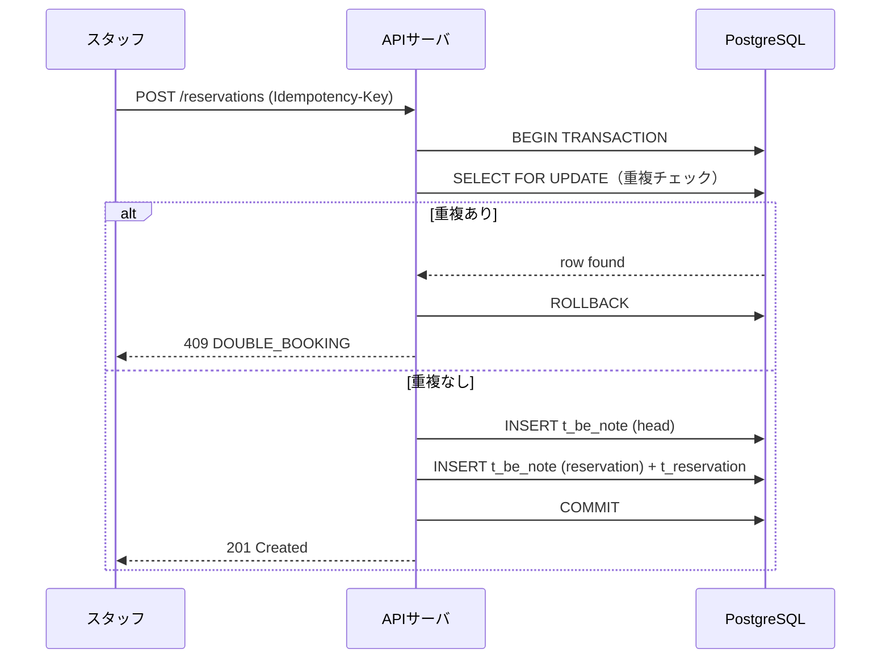
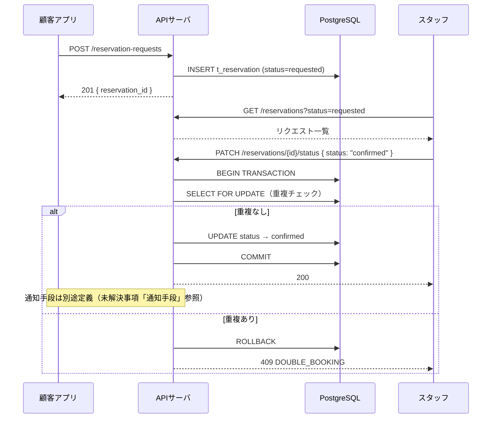

# 予約ロジック設計書

> Be:note サロン予約管理システム

---

## 概要

本書は予約機能に関わる以下を定義する。

- 予約の状態遷移
- ダブルブッキング防止の仕組み
- 空き時間算出ロジック
- 不足マスタの追加定義
- テーブル設計（DDL）
- API エンドポイント（予約系）
- シーケンス図

### 方針

- 既存の pptx / xlsx 設計書は破棄し、Markdown で全設計を管理する
- 対象サービス：美容室・ネイルサロン・エステなど美容系サービス全般
- DB は PostgreSQL を使用する（Supabase）
- API は `/api/v1/` バージョニングを採用する
- `salon_id` は最初から全テーブルに持たせる。MVP は1店舗固定、多店舗展開時に `t_salon_group` と `t_client_salon` を活用する
- 主キーは全テーブル **UUID（v7 推奨）**。クライアント生成可とし、スマホアプリのオフライン作成／同期に備える（`t_note_type` のみ固定語彙の `SMALLINT`）

### 技術スタック

| レイヤー | 採用技術 |
|---|---|
| フロントエンド | Next.js + TypeScript |
| 認証 | Supabase Auth（Google / Instagram / Be:note独自 → フェーズ2でLINE追加） |
| DB | Supabase（PostgreSQL） |
| リアルタイム | Supabase Realtime（予約ボード同期） |
| ファイル保存 | Supabase Storage（ビフォー/アフター写真） |
| 将来のアプリ化 | React Native（Expo） |

- 開発中は無料枠を使用。本番移行時に Pro（$25/月）へ切り替える
- 認証は全クライアント（顧客・スタッフ・管理者）で共通。ロールは DB で管理し、ログイン方式とは独立する

### ログイン方式

| フェーズ | 方式 | 備考 |
|---|---|---|
| 1 | Be:note独自（メール＋パスワード） | パスワードリセット・メール認証が必要 |
| 1 | Google | OAuth2 |
| 1 | Instagram | Meta OAuth。将来の投稿機能の基盤を兼ねる |
| 2 | LINE | 後回し |

通知手段はログイン方式の実装完了後に定義する。

### プロジェクト構成

リポジトリはモノレポ構成とし、以下のディレクトリで管理する。

| ディレクトリ | 用途 |
|---|---|
| `web/` | Next.js（Web 管理ツール・顧客向け Web）|
| `mobile/` | React Native（Expo）アプリ |
| `docs/` | 設計書（本書を含む Markdown 一式）|
| `supabase/migrations/` | DB マイグレーション（DDL）|

`web/` のルーティングは Next.js の Route Groups を用いて、認証状態・ロール別にレイアウトを分離する方針とする。

---

## 予約の状態遷移

### 即時予約（店舗・スタッフ操作）

```
[draft] → [confirmed] → [checked_in] → [in_progress] → [done]
               ↓                               ↓
          [cancelled]                     [cancelled]
```

| status | 説明 |
|---|---|
| `draft` | 仮作成（枠をブロックしない。ダブルブッキング制約の対象外） |
| `confirmed` | 予約確定（枠ロック済み） |
| `checked_in` | 来店確認済み（`actual_start` 記録） |
| `in_progress` | 施術中（`current_task_id` が進行中） |
| `done` | 会計完了（`actual_end` 記録） |
| `cancelled` | キャンセル（理由と操作者を記録） |

### リクエスト予約（顧客操作）

```
[requested] → [pending] → [confirmed] → [checked_in] → [in_progress] → [done]
                  ↓             ↓                              ↓
            [rejected]     [cancelled]                    [cancelled]
```

| status | 説明 |
|---|---|
| `requested` | 顧客が申込送信 |
| `pending` | スタッフ側で受付中（審査待ち） |
| `confirmed` | スタッフが承認し枠確定 |
| `rejected` | スタッフが却下（理由を顧客に通知） |

### ステータス変更権限マトリクス

| 操作 | customer | staff | admin |
|---|---|---|---|
| → requested | ✓ | - | ✓ |
| pending → confirmed / rejected | - | ✓ | ✓ |
| confirmed → checked_in | - | ✓ | ✓ |
| checked_in → in_progress | - | ✓ | ✓ |
| in_progress → done | - | ✓ | ✓ |
| any → cancelled | ✓（自分の予約のみ） | ✓ | ✓ |

### `done_flg` との関係

既存の `done_flg` は `status = 'done'` と対応する。  
実データが存在しないため、`done_flg` は削除し `status` に統一する。

### 通知手段

通知手段はログイン設計と連動するため、ログイン方式確定後に定義する。（未解決事項「通知手段」参照）

---

## ダブルブッキング防止

### 防止対象

「同一スタッフ」が「重複する時間帯」に複数の `confirmed` 以上の予約を持ってはいけない。  
設備上限・顧客の同日重複チェックは対象外とする。

衝突検出時はエラーメッセージを表示するのみとする（代替候補の自動提案は行わない）。

### 二重防御の仕組み

#### レイヤー①：アプリ層（楽観ロック＋冪等キー）

- 予約作成リクエストに `idempotency_key`（UUID）を付与
- 同一キーの再送は 200 を返して冪等にする
- トランザクション内で `SELECT FOR UPDATE NOWAIT` により既存レコードをロック

```sql
SELECT note_id FROM t_reservation
WHERE staff_id = $1
  AND status IN ('confirmed', 'checked_in', 'in_progress')
  AND tstzrange(reservation_start, reservation_end) && tstzrange($2, $3)
FOR UPDATE NOWAIT;
-- 1行でも取れたら 409 Conflict
```

#### レイヤー②：DB 層（PostgreSQL EXCLUDE 制約）

```sql
CREATE EXTENSION IF NOT EXISTS btree_gist;

ALTER TABLE t_reservation
  ADD CONSTRAINT no_double_booking
  EXCLUDE USING gist (
    staff_id WITH =,
    tstzrange(reservation_start, reservation_end, '[)') WITH &&
  )
  WHERE (status IN ('confirmed', 'checked_in', 'in_progress'));
```

- `draft` / `cancelled` / `rejected` は `WHERE` 対象外 → キャンセル済みの枠に再予約できる

---

## 空き時間算出ロジック

### 入力パラメータ

| パラメータ | 必須 | 説明 |
|---|---|---|
| `date` | ✓ | 対象日 |
| `menu_master_id` | ✓ | 希望メニュー（所要時間取得のため） |
| `staff_id` | - | 指名スタッフ。省略時は全スタッフ対象 |

### 算出手順

```
1. t_business_hour から営業時間を取得（曜日別）
2. t_holiday で定休日・臨時休業か確認 → 休みなら空き=0
3. t_shift で対象日のスタッフごとの出勤時間帯を取得
4. t_reservation で当日の confirmed 以上の予約を取得
5. 「営業時間 ∩ 出勤時間」から「既存予約」を除いた空き時間帯を算出
6. 空き時間帯 >= menu_master.duration_minutes のスロットを15分刻みで返す
```

### レスポンスのロール制御

| 項目 | customer（指名なし） | customer（指名あり） | staff / admin |
|---|---|---|---|
| 時間スロット | ✓ | ✓ | ✓ |
| staff_id / staff_name | - | ✓ | ✓ |
| 予約件数・混雑情報 | - | - | ✓ |

- 指名なしの場合、顧客には時間帯のみ返す。担当スタッフは店舗側が後から割り当てる
- 複数メニュー選択時の所要時間はアプリ層で `duration_minutes` を合算して算出する

---

## 不足マスタの追加定義

### t_salon_group（サロングループ）

複数店舗を束ねるグループ会社単位のマスタ。MVP では1件固定。

```sql
CREATE TABLE t_salon_group (
    group_id    UUID  PRIMARY KEY DEFAULT gen_random_uuid(),
    group_name  VARCHAR(50)  NOT NULL,
    delete_flg  BOOLEAN      NOT NULL DEFAULT false
);
```

### t_salon（店舗）

美容室・ネイルサロン・エステなど業種を問わず利用できる。  
`cancel_deadline_days`（キャンセル期限）はサロンごとに設定可能。デフォルト 1 = 当日キャンセル不可。

```sql
CREATE TABLE t_salon (
    salon_id              UUID  PRIMARY KEY DEFAULT gen_random_uuid(),
    group_id              UUID  REFERENCES t_salon_group,
    salon_name            VARCHAR(50)  NOT NULL,
    salon_type            VARCHAR(20)  NOT NULL DEFAULT 'hair',
      -- 'hair' | 'nail' | 'esthe' | 'other'
    address               VARCHAR(100),
    phone                 VARCHAR(20),
    cancel_deadline_days  INTEGER      NOT NULL DEFAULT 1,
    delete_flg            BOOLEAN      NOT NULL DEFAULT false
);
```

### t_client_salon（顧客×サロン中間テーブル）

顧客はプラットフォームレベルで管理し、ランク・来店回数・メモはサロンごとに持つ。  
`t_client` から `client_rank` / `total_visit` / `memo` を移動。

```sql
CREATE TABLE t_client_salon (
    client_id    UUID  NOT NULL REFERENCES t_client,
    salon_id     UUID  NOT NULL REFERENCES t_salon,
    client_rank  VARCHAR(10),
    total_visit  INTEGER      NOT NULL DEFAULT 0,
    first_visit  DATE,
    memo         VARCHAR(300),
    delete_flg   BOOLEAN      NOT NULL DEFAULT false,
    PRIMARY KEY (client_id, salon_id)
);
```

### t_staff（スタッフ）

既存設計でスタッフが名前文字列（`"店長太郎"`）で参照されている問題を解消する。  
`nomination_fee`（指名料）を持たせ、技術料と分離して管理する。

```sql
CREATE TABLE t_staff (
    staff_id        UUID  PRIMARY KEY DEFAULT gen_random_uuid(),
    salon_id        UUID  NOT NULL REFERENCES t_salon,
    staff_name      VARCHAR(20)  NOT NULL,
    staff_kana      VARCHAR(20),
    position        VARCHAR(10)  NOT NULL,  -- 職位: 'stylist' | 'assistant'
    is_admin        BOOLEAN      NOT NULL DEFAULT false,  -- 管理者権限（true で JWT ロール=admin）
    nomination_fee  INTEGER      NOT NULL DEFAULT 0,
    delete_flg      BOOLEAN      NOT NULL DEFAULT false
);
```

### t_menu_master（メニューマスタ）

```sql
CREATE TABLE t_menu_master (
    menu_master_id   UUID       PRIMARY KEY DEFAULT gen_random_uuid(),
    salon_id         UUID  NOT NULL REFERENCES t_salon,
    menu_name        VARCHAR(20)  NOT NULL,
    kinds            VARCHAR(20),
    base_price       INTEGER      NOT NULL,      -- 技術料
    duration_minutes INTEGER      NOT NULL,      -- 標準所要時間（分）
    delete_flg       BOOLEAN      NOT NULL DEFAULT false
);
```

### t_note_type（note種別マスタ）

将来の note_type 追加に対応するためマスタテーブルで管理する。  
API は `note_type_code`（文字列）で受け渡し、DAO 層で `note_type_id` に変換する。

```sql
CREATE TABLE t_note_type (
    note_type_id   SMALLINT     PRIMARY KEY,
    note_type_code VARCHAR(20)  NOT NULL UNIQUE,
    description    VARCHAR(50)
);

INSERT INTO t_note_type VALUES
  (1, 'head',        '来店親ノード'),
  (2, 'reservation', '予約'),
  (3, 'item',        '物販'),
  (4, 'discount',    '割引'),
  (5, 'photo',       '写真'),
  (6, 'text',        'テキストメッセージ');
```

### t_task（工程マスタ）

予約ボードのタスク列（check_in / wash / cut / ... / check_out）を定義する。

```sql
CREATE TABLE t_task (
    task_id     UUID      PRIMARY KEY DEFAULT gen_random_uuid(),
    salon_id    UUID  NOT NULL REFERENCES t_salon,
    task_name   VARCHAR(20)  NOT NULL,
    task_order  INTEGER      NOT NULL,
    role_limit  VARCHAR(10)  DEFAULT NULL  -- NULL=制限なし, 'stylist'=position が stylist のみ可
);
```

### t_staff_skill（スタッフ可能タスク）

アシスタントのタスク制限をDB管理する。マスタメンテ画面から変更できる。

```sql
CREATE TABLE t_staff_skill (
    staff_id  UUID  NOT NULL REFERENCES t_staff,
    task_id   UUID      NOT NULL REFERENCES t_task,
    PRIMARY KEY (staff_id, task_id)
);
```

### t_business_hour（営業時間マスタ）

```sql
CREATE TABLE t_business_hour (
    salon_id    UUID  NOT NULL REFERENCES t_salon,
    day_of_week SMALLINT     NOT NULL,  -- 0=日 〜 6=土
    open_time   TIME         NOT NULL,
    close_time  TIME         NOT NULL,
    PRIMARY KEY (salon_id, day_of_week)
);
```

### t_holiday（定休日・臨時休業）

```sql
CREATE TABLE t_holiday (
    salon_id      UUID  NOT NULL REFERENCES t_salon,
    holiday_date  DATE         NOT NULL,
    reason        VARCHAR(50),
    PRIMARY KEY (salon_id, holiday_date)
);
```

### t_shift（スタッフシフト）

```sql
CREATE TABLE t_shift (
    shift_id    UUID       PRIMARY KEY DEFAULT gen_random_uuid(),
    staff_id    UUID  NOT NULL REFERENCES t_staff,
    shift_date  DATE         NOT NULL,
    start_time  TIME         NOT NULL,
    end_time    TIME         NOT NULL,
    delete_flg  BOOLEAN      NOT NULL DEFAULT false
);
CREATE UNIQUE INDEX idx_shift_staff_date
    ON t_shift (staff_id, shift_date)
    WHERE delete_flg = false;
```

### t_reservation_slot（予約枠）

```sql
CREATE TABLE t_reservation_slot (
    slot_id     UUID       PRIMARY KEY DEFAULT gen_random_uuid(),
    salon_id    UUID  NOT NULL REFERENCES t_salon,
    slot_name   VARCHAR(30)  NOT NULL,
    delete_flg  BOOLEAN      NOT NULL DEFAULT false
);
```

---

## 既存テーブルへの変更

### t_client

| 変更 | 内容 |
|---|---|
| `client_lank` → `client_rank` | タイポ修正 |
| `allergy` | キー末尾スペース除去 |
| `client_id` 型 | UUID に変更（`CID...`／`UID...` の文字列体系を廃止） |
| `client_rank` / `total_visit` / `memo` を削除 | `t_client_salon` に移動（サロンごとに管理） |

### t_be_note

```sql
ALTER TABLE t_be_note
  -- note_type を t_note_type の外部キーに変更
  ADD CONSTRAINT fk_note_type FOREIGN KEY (note_type) REFERENCES t_note_type(note_type_id),
  ADD COLUMN salon_id UUID REFERENCES t_salon;
```

### t_reservation（追加カラム）

```sql
ALTER TABLE t_reservation
  ADD COLUMN salon_id        UUID  REFERENCES t_salon,
  ADD COLUMN slot_id         UUID      REFERENCES t_reservation_slot,
  ADD COLUMN staff_id        UUID  REFERENCES t_staff,
  ADD COLUMN status          VARCHAR(20)  NOT NULL DEFAULT 'confirmed',
    -- 'draft'|'confirmed'|'checked_in'|'in_progress'|'done'
    -- |'requested'|'pending'|'rejected'|'cancelled'
  ADD COLUMN reserve_type    VARCHAR(10)  NOT NULL DEFAULT 'immediate',
    -- 'immediate'|'request'
  ADD COLUMN cancel_reason   VARCHAR(100),
  ADD COLUMN idempotency_key UUID         UNIQUE,
  ADD COLUMN version_no      INTEGER      NOT NULL DEFAULT 1,
  ADD COLUMN payment_method  VARCHAR(10)  DEFAULT NULL,
    -- NULL（未会計）| 'cash' | 'card' | 'qr'
  ADD COLUMN no_show_flg     BOOLEAN      NOT NULL DEFAULT false;

-- ダブルブッキング除外制約
CREATE EXTENSION IF NOT EXISTS btree_gist;
ALTER TABLE t_reservation
  ADD CONSTRAINT no_double_booking EXCLUDE USING gist (
    staff_id WITH =,
    tstzrange(reservation_start, reservation_end, '[)') WITH &&
  ) WHERE (status IN ('confirmed', 'checked_in', 'in_progress'));
```

### t_menu（スタッフ参照を staff_id に変更）

```sql
ALTER TABLE t_menu
  ADD COLUMN staff_id       UUID REFERENCES t_staff,
  ADD COLUMN menu_master_id UUID REFERENCES t_menu_master;  -- 元メニュー（任意。追跡用）
-- staff（名前文字列）は削除。menu_name は予約時点のスナップショットとして残す
```

---

## note_type 表現

- **API 層**：`note_type_code`（文字列）で受け渡す
- **DB 層**：`note_type_id`（tinyint）で保存
- **変換**：DAO 層で `t_note_type` を参照して変換する
- カラムコメントに対応表を記載する

---

## API エンドポイント（予約系）

予約系 API の詳細仕様は **API設計書を正とする**（本書では重複定義しない）。設計上の要点のみ示す。

- ベース `/api/v1`、認証 `Authorization: Bearer <JWT>`、日時は ISO 8601 UTC。
- 即時予約作成・予約編集・`confirmed` への遷移は、**冪等キー（`Idempotency-Key`）＋楽観ロック（`version_no`）** で二重防御する（「ダブルブッキング防止」参照）。
- ステータス更新は「ステータス変更権限マトリクス」に従う。
- 空き時間算出は「空き時間算出ロジック」に従う。

| メソッド | パス | 概要 |
|---|---|---|
| GET | `/availability` | 空き時間取得 |
| GET / POST | `/reservations` | 予約一覧取得 / 即時予約作成 |
| POST | `/reservation-requests` | リクエスト予約申込（顧客） |
| GET / PUT | `/reservations/{note_id}` | 予約詳細取得 / 編集 |
| PATCH | `/reservations/{note_id}/status` | ステータス更新 |
| PATCH | `/reservations/{note_id}/task` | タスク進行（予約ボード D&D） |

---

## シーケンス図

### 即時予約作成フロー



### リクエスト予約 → 承認フロー



---

## 未解決事項

| 項目 | 状態 | 内容 |
|---|---|---|
| 通知手段 | 保留 | ログイン方式（フェーズ1）実装後に定義する。候補：FCM Push / メール |
| 外部決済連携 | 将来 | MVP は手動会計。連携時に `t_payment` テーブルを追加 |
| キャンセル手数料 | 将来 | 当日キャンセル不可はデフォルト設定済み。手数料徴収は外部決済連携と合わせて検討 |
| Instagram 投稿機能 | 将来 | Instagram Login の基盤を活用。`instagram_content_publish` 権限追加で対応 |
| LINE ログイン | フェーズ2 | フェーズ1（独自・Google・Instagram）完了後に追加 |
