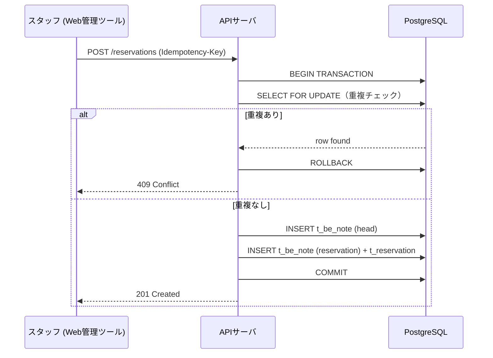
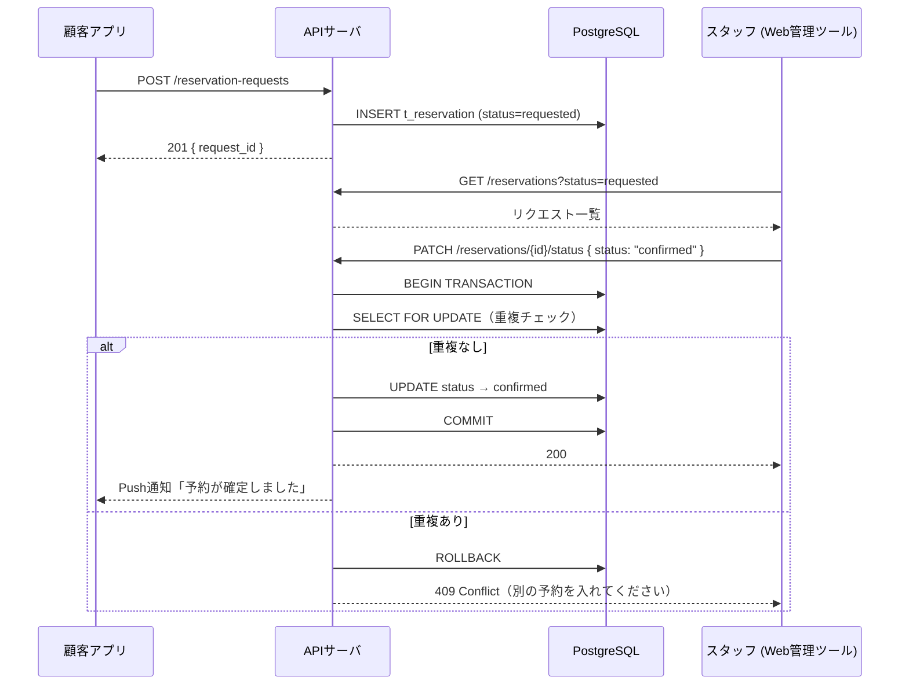

# 予約ロジック設計書

> Be:note サロン予約管理システム  
> 版数：00.01 / 2026-05-29

---

## 1. 概要

本書は予約機能に関わる以下を定義する。

1. 予約の状態遷移
2. ダブルブッキング防止の仕組み
3. 空き時間算出ロジック
4. 不足マスタの追加定義
5. テーブル設計（DDL）
6. API エンドポイント（予約系）
7. シーケンス図

---

## 2. 予約の状態遷移

### 2-1. 即時予約（店舗・スタッフ操作）

```
[draft] → [confirmed] → [checked_in] → [in_progress] → [done]
                 ↓                              ↓
           [cancelled]                    [cancelled]
```

| status | 説明 |
|---|---|
| `draft` | 仮作成（ダブルブッキングチェック前） |
| `confirmed` | 予約確定（枠ロック済み） |
| `checked_in` | 来店確認済み（actual_start 記録） |
| `in_progress` | 施術中（current_task_id が進行中） |
| `done` | 会計完了（actual_end 記録、done_flg=true） |
| `cancelled` | キャンセル（理由と操作者を記録） |

### 2-2. リクエスト予約（顧客操作）

```
[requested] → [pending] → [confirmed] → [checked_in] → [in_progress] → [done]
                  ↓              ↓                              ↓
            [rejected]      [cancelled]                   [cancelled]
```

| status | 説明 |
|---|---|
| `requested` | 顧客が申込送信 |
| `pending` | スタッフ側で受付中（審査待ち） |
| `confirmed` | スタッフが承認し枠確定 |
| `rejected` | スタッフが却下（理由を顧客に通知） |

### 2-3. ステータス変更権限マトリクス

| 操作 | customer | staff | admin |
|---|---|---|---|
| requested → pending | ✓ | - | ✓ |
| pending → confirmed/rejected | - | ✓ | ✓ |
| confirmed → checked_in | - | ✓ | ✓ |
| any → cancelled | ✓（自分の予約のみ） | ✓ | ✓ |
| in_progress → done | - | ✓ | ✓ |

---

## 3. ダブルブッキング防止

### 3-1. 問題の定義

「同一スタッフ」が「重複する時間帯」に複数の `confirmed` 以上の予約を持ってはいけない。

### 3-2. 二重防御の仕組み

#### レイヤー①：アプリ層（楽観ロック＋冪等キー）

- 予約作成リクエストに `idempotency_key`（UUID）を付与
- 同一キーの再送は 200 を返して冪等にする
- `reservation_start / reservation_end` を条件に先に `SELECT FOR UPDATE` で既存レコードをロック

```sql
-- ステップ1: 当該スタッフの重複チェック（アプリ層）
SELECT id FROM t_reservation
WHERE staff_id = $1
  AND status IN ('confirmed', 'checked_in', 'in_progress')
  AND tstzrange(reservation_start, reservation_end) && tstzrange($2, $3)
FOR UPDATE NOWAIT;
-- 1行でも取れたらダブルブッキングエラー（409 Conflict）
```

#### レイヤー②：DB 層（PostgreSQL EXCLUDE 制約）

```sql
-- t_reservation に除外制約を追加
-- btree_gist 拡張が必要
CREATE EXTENSION IF NOT EXISTS btree_gist;

ALTER TABLE t_reservation
  ADD CONSTRAINT no_double_booking
  EXCLUDE USING gist (
    staff_id   WITH =,
    tstzrange(reservation_start, reservation_end, '[)') WITH &&
  )
  WHERE (status IN ('confirmed', 'checked_in', 'in_progress'));
```

> **ポイント**：`WHERE` 句で `cancelled` / `rejected` / `draft` を除外することで  
> キャンセル済みの枠に再予約できる。

#### レイヤー③：枠ベース制御（オプション）

`t_reservation_slot` テーブルで「同時受け入れ可能人数」を定義。  
例：シャンプー台が 3 台あれば `capacity=3` → 同時刻の予約を 3 件まで許可。

---

## 4. 空き時間算出ロジック

顧客向けアプリの「空き状況」表示に使用する。

### 4-1. 入力

| パラメータ | 説明 |
|---|---|
| `date` | 対象日 |
| `menu_master_id` | 希望メニュー（所要時間を取得するため） |
| `staff_id`（省略可） | 指定スタッフ。省略時は全スタッフ対象 |

### 4-2. 算出手順

```
1. t_business_hour から営業時間を取得（曜日別）
2. t_holiday から対象日が定休日・臨時休業か確認 → 休みなら空き=0
3. t_shift から対象日のスタッフごとの出勤時間帯を取得
4. t_reservation から当日の confirmed 以上の予約を取得（スタッフ×時間帯）
5. 「営業時間 ∩ 出勤時間」から「既存予約」を除いた空き時間帯を算出
6. 空き時間帯 >= メニュー所要時間 (menu_master.duration_minutes) のスロットを返す
```

### 4-3. 空き時間算出の擬似コード

```python
def get_available_slots(date, menu_master_id, staff_id=None):
    duration = get_duration(menu_master_id)  # 例: 90分
    staffs = [staff_id] if staff_id else get_working_staffs(date)
    
    slots = []
    for staff in staffs:
        free_ranges = get_free_ranges(staff, date)  # 営業時間∩シフト - 既存予約
        for start, end in free_ranges:
            # 15分刻みでスロット生成
            t = start
            while t + duration <= end:
                slots.append({"staff": staff, "start": t, "end": t + duration})
                t += timedelta(minutes=15)
    
    return slots
```

---

## 5. 不足マスタの追加定義

既存資料（IF設計書）には以下のマスタが不足している。予約ロジックに必要なものを定義する。

### 5-1. t_salon（予約グループ）

```sql
CREATE TABLE t_salon (
    salon_id    VARCHAR(10)  PRIMARY KEY,  -- 'SAL0000001'
    salon_name  VARCHAR(50)  NOT NULL,
    address     VARCHAR(100),
    phone       VARCHAR(20),
    delete_flg  BOOLEAN      NOT NULL DEFAULT false
);
```

### 5-2. t_staff（スタッフ）

> **現状の課題**：JSON/既存テーブルでスタッフが名前文字列（`"店長太郎"`）で持たれている。  
> 改名・退職・同名スタッフで参照が破綻するため、`staff_id` を導入する。

```sql
CREATE TABLE t_staff (
    staff_id    VARCHAR(10)  PRIMARY KEY,  -- 'STF0000001'
    salon_id    VARCHAR(10)  NOT NULL REFERENCES t_salon,
    staff_name  VARCHAR(20)  NOT NULL,
    staff_kana  VARCHAR(20),
    role        VARCHAR(10)  NOT NULL,  -- 'admin' | 'stylist' | 'assistant'
    delete_flg  BOOLEAN      NOT NULL DEFAULT false
);
```

### 5-3. t_menu_master（メニューマスタ）

```sql
CREATE TABLE t_menu_master (
    menu_master_id  SERIAL       PRIMARY KEY,
    salon_id        VARCHAR(10)  NOT NULL REFERENCES t_salon,
    menu_name       VARCHAR(20)  NOT NULL,  -- 'cut', 'special', 'treatment' ...
    kinds           VARCHAR(20),
    base_price      INTEGER      NOT NULL,
    duration_minutes INTEGER     NOT NULL,  -- 標準所要時間（分）
    delete_flg      BOOLEAN      NOT NULL DEFAULT false
);
```

### 5-4. t_task（工程マスタ）

予約ボードのタスク列（check_in / wash / cat / special / ... / check_out）を定義。

```sql
CREATE TABLE t_task (
    task_id     INTEGER      PRIMARY KEY,
    salon_id    VARCHAR(10)  NOT NULL REFERENCES t_salon,
    task_name   VARCHAR(20)  NOT NULL,  -- 'check_in', 'wash', 'cut' ...
    task_order  INTEGER      NOT NULL,  -- 列順
    role_limit  VARCHAR(10)  DEFAULT NULL  -- NULL=制限なし, 'stylist'=スタイリスト以上
);
```

### 5-5. t_staff_skill（スタッフ可能タスク）

アシスタントのタスク制限（pptx p.16「アシスタント行：一部タスクに制限」）。

```sql
CREATE TABLE t_staff_skill (
    staff_id  VARCHAR(10)  NOT NULL REFERENCES t_staff,
    task_id   INTEGER      NOT NULL REFERENCES t_task,
    PRIMARY KEY (staff_id, task_id)
);
```

### 5-6. t_business_hour（営業時間マスタ）

```sql
CREATE TABLE t_business_hour (
    salon_id    VARCHAR(10)  NOT NULL REFERENCES t_salon,
    day_of_week SMALLINT     NOT NULL,  -- 0=日 〜 6=土
    open_time   TIME         NOT NULL,
    close_time  TIME         NOT NULL,
    PRIMARY KEY (salon_id, day_of_week)
);
```

### 5-7. t_holiday（定休日・臨時休業）

```sql
CREATE TABLE t_holiday (
    salon_id    VARCHAR(10)  NOT NULL REFERENCES t_salon,
    holiday_date DATE        NOT NULL,
    reason      VARCHAR(50),  -- '定休日', '夏季休業' ...
    PRIMARY KEY (salon_id, holiday_date)
);
```

### 5-8. t_shift（スタッフシフト）

```sql
CREATE TABLE t_shift (
    shift_id    SERIAL       PRIMARY KEY,
    staff_id    VARCHAR(10)  NOT NULL REFERENCES t_staff,
    shift_date  DATE         NOT NULL,
    start_time  TIME         NOT NULL,
    end_time    TIME         NOT NULL,
    delete_flg  BOOLEAN      NOT NULL DEFAULT false
);
CREATE UNIQUE INDEX idx_shift_staff_date ON t_shift (staff_id, shift_date) WHERE delete_flg = false;
```

### 5-9. t_reservation_slot（予約枠）

pptx 要件定義「中分類：予約枠（施術内容ごと）」の実体。

```sql
CREATE TABLE t_reservation_slot (
    slot_id     SERIAL       PRIMARY KEY,
    salon_id    VARCHAR(10)  NOT NULL REFERENCES t_salon,
    slot_name   VARCHAR(30)  NOT NULL,
    capacity    INTEGER      NOT NULL DEFAULT 1,  -- 同時受け入れ可能数
    delete_flg  BOOLEAN      NOT NULL DEFAULT false
);
```

---

## 6. 既存テーブルへの変更点

### 6-1. t_client（既存）

| 変更 | 内容 |
|---|---|
| `client_lank` → `client_rank` | タイポ修正 |
| `"allergy "` → `allergy` | キー末尾スペース除去 |
| `client_id` 体系を `CID...` に統一 | note.json の `UID...` との不整合解消 |

### 6-2. t_reservation（既存 + 追加カラム）

```sql
-- 既存カラムに追加
ALTER TABLE t_reservation
  ADD COLUMN salon_id    VARCHAR(10)  REFERENCES t_salon,
  ADD COLUMN slot_id     INTEGER      REFERENCES t_reservation_slot,
  ADD COLUMN staff_id    VARCHAR(10)  REFERENCES t_staff,  -- 主担当
  ADD COLUMN status      VARCHAR(20)  NOT NULL DEFAULT 'confirmed',
  ADD COLUMN reserve_type VARCHAR(20) NOT NULL DEFAULT 'immediate',  -- 'immediate'|'request'
  ADD COLUMN cancel_reason VARCHAR(100),
  ADD COLUMN idempotency_key UUID     UNIQUE,  -- 冪等キー
  ADD COLUMN version_no  INTEGER      NOT NULL DEFAULT 1;  -- 楽観ロック用

-- ダブルブッキング除外制約（DB 層防御）
CREATE EXTENSION IF NOT EXISTS btree_gist;
ALTER TABLE t_reservation
  ADD CONSTRAINT no_double_booking EXCLUDE USING gist (
    staff_id WITH =,
    tstzrange(reservation_start, reservation_end, '[)') WITH &&
  ) WHERE (status IN ('confirmed', 'checked_in', 'in_progress'));
```

### 6-3. t_menu（既存：明細テーブル）

スタッフを名前文字列から `staff_id` に変更。

```sql
ALTER TABLE t_menu
  ADD COLUMN staff_id VARCHAR(10) REFERENCES t_staff;
-- staff（名前文字列）はデータ移行後に削除
```

---

## 7. note_type の表現統一

| note_type 値 | API（文字列） | DB（tinyint） |
|---|---|---|
| 親ノード | `head` | `1` |
| 予約 | `reservation` | `2` |
| 物販 | `item` | `3` |
| 割引 | `discount` | `4` |
| 写真 | `photo` | `5` |
| テキスト | `text` | `6` |

- **API 層**: 文字列で受け渡し（人間に読みやすい）
- **DB 層**: tinyint で保存（既存設計どおり）
- 変換はリポジトリ層（DAO）で行う

---

## 8. API エンドポイント（予約系）

> 認証: Bearer JWT（ロールクレーム: `customer` / `staff` / `admin`）

### 8-1. 空き時間取得

```
GET /api/v1/availability
Query: date, menu_master_id, staff_id(optional)
Auth: customer / staff / admin
Response:
[
  {
    "staff_id": "STF0000001",
    "staff_name": "店長太郎",
    "slots": [
      { "start": "2026-06-01T10:00:00", "end": "2026-06-01T11:30:00" }
    ]
  }
]
```

### 8-2. 予約一覧取得

```
GET /api/v1/reservations
Query: date, staff_id(optional), status(optional)
Auth: staff / admin
Response: [{ reservation_id, client_id, staff_id, status, reservation_start, ... }]
```

### 8-3. 予約作成（即時予約）

```
POST /api/v1/reservations
Header: Idempotency-Key: <UUID>
Auth: staff / admin
Body:
{
  "client_id": "CID0000001",
  "staff_id": "STF0000001",
  "slot_id": 1,
  "reservation_start": "2026-06-01T10:00:00",
  "reservation_end": "2026-06-01T11:30:00",
  "main_menu": "カット＆カラー",
  "menu_list": [...]
}
Response: 201 / 409 Conflict（ダブルブッキング）
```

### 8-4. 予約申込（リクエスト予約・顧客操作）

```
POST /api/v1/reservation-requests
Header: Idempotency-Key: <UUID>
Auth: customer
Body: { "desired_start": ..., "menu_master_id": ..., "staff_id"(optional): ... }
Response: 201 { request_id, status: "requested" }
```

### 8-5. 予約ステータス更新

```
PATCH /api/v1/reservations/{reservation_id}/status
Auth: staff / admin (顧客は cancelled のみ)
Body: { "status": "confirmed" | "rejected" | "checked_in" | "done" | "cancelled", "reason"(optional) }
Response: 200 / 409（ダブルブッキング発生時）
```

### 8-6. タスク進行（予約ボード D&D）

```
PATCH /api/v1/reservations/{reservation_id}/task
Auth: staff / admin
Body: { "task_id": 3 }  -- 現在の task_id を更新
Response: 200
```

---

## 9. シーケンス図

### 9-1. 即時予約作成フロー



### 9-2. リクエスト予約→承認フロー



---

## 10. 未解決事項・今後の検討

| No. | 項目 | 内容 |
|---|---|---|
| 1 | 技術スタック | BaaS（Supabase）vs フルカスタム未決定 |
| 2 | 会計・税計算 | 消費税率・ポイント・複数決済手段のモデルなし |
| 3 | キャンセルポリシー | 何時間前まで無料キャンセル可能か |
| 4 | 通知手段 | Push通知の実装（LINE Messaging API / FCM） |
| 5 | 写真保存パス | `"path":"C:/XXX"` はローカルパス → クラウドストレージ URL に変更必要 |
| 6 | version_number の用途確定 | 楽観ロック用 or 編集履歴用（両方なら別カラムに分離） |
| 7 | 顧客ID体系の統一 | `CID...` / `UID...` の不整合解消 |
| 8 | 多店舗展開 | salon_id をどこまで徹底するか（t_be_note にも必要か） |
